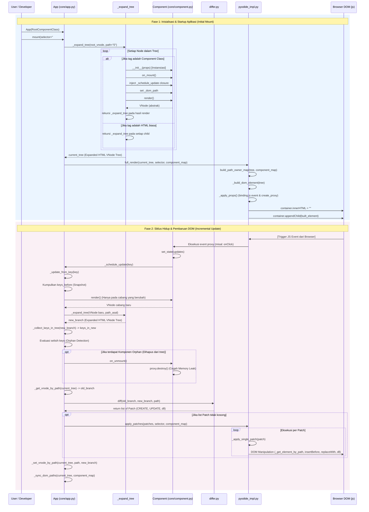

# Pyon-Py Internals: Panduan Arsitektur & Alur Kerja Framework

Dokumen ini disusun sebagai panduan komprehensif bagi kontributor baru untuk memahami cara kerja internal framework Pyon-Py. Framework ini diimplementasikan menggunakan Python murni dengan arsitektur Virtual DOM yang dikompilasi/dijalankan pada browser melalui WebAssembly (WASM) via Pyodide.

## Deskripsi Tingkat Tinggi (High-Level Overview)

Pyon-Py beroperasi sebagai sebuah framework antarmuka pengguna (UI) reaktif berbasis komponen. Arsitektur framework ini memisahkan secara ketat antara representasi logis dari UI (Virtual DOM) di dalam direktori `core/` dan manipulasi elemen aktual di browser (Real DOM) di dalam direktori `bridge/`.

Framework ini beroperasi menggunakan dua siklus utama:
1. **Initial Mount**: Mengubah struktur komponen abstrak menjadi pohon elemen DOM untuk pertama kalinya.
2. **Incremental Update (Reconciliation)**: Membandingkan perubahan (diffing) antar dua status Virtual DOM yang berbeda akibat mutasi state, kemudian menerapkan instruksi perubahan tersebut ke elemen DOM yang tepat dengan pergerakan minimal (patching).

---

## Diagram Alur Kerja Eksekusi (Workflow)

Diagram di bawah ini memetakan seluruh rantai pemanggilan fungsi (function calls) dari mulai inisialisasi awal (Startup/Mounting) hingga pada pembaruan saat *runtime* (DOM Updates/Reconciliation).

---

## Penjelasan Detail: Alur Inisialisasi & Startup Aplikasi (Initial Mount)

Fase ini terjadi saat aplikasi pertama kali dimuat di browser.

### 1. Titik Masuk (Entry Point): `App.__init__` & `App.mount`
* **Lokasi**: `core/app.py`
* **Deskripsi**: Siklus dimulai saat pengguna membuat instance `App` dengan meneruskan kelas komponen akar (root) dan memanggil metode `mount()`.
* **Proses Detail**:
  - `App(RootComponent)` menyimpan kelas komponen ke variabel instance `self.root_class`.
  - `App.mount(selector="#app")` dipanggil. Metode ini membangun struktur `VNode` abstrak pertama yang membungkus komponen root.
  - Memanggil `_expand_tree()` secara internal.

### 2. Ekspansi Pohon Logis: `_expand_tree`
* **Lokasi**: `core/app.py`
* **Deskripsi**: Mengubah (expand) struktur pohon logis yang berisi referensi tipe komponen abstrak menjadi pohon Virtual Node (VNode) yang seluruhnya hanya terdiri dari tag HTML murni (primitif).
* **Fungsi dan Variabel Terkait**:
  - **Argumen**: `node` (VNode saat ini), `path` (lokasi DOM berbasis indeks seperti "0.1"), `parent_key` (kunci parent hierarkis), `component_map` (peta `full_key` ke instance), dan `app` (referensi induk).
  - **Instansiasi Komponen**: Jika `node.tag` adalah referensi ke class turunan `Component`, sistem mengekstrak `props["key"]`, membuat kunci hierarkis (`full_key`), dan membuat instance (objek) dari kelas tersebut.
  - **Siklus Hidup Awal**: Memanggil `instance.on_mount()` secara berurutan.
  - **Binding Reaktivitas**: Menyuntikkan _closure_ ke dalam instance bernama `_schedule_update` yang dikaitkan kuat (bind) pada fungsi pembaruan inkremental `app._update_from_key(full_key)`.
  - **Manajemen DOM Path**: Mencatat parameter `path` ke `instance._dom_path`.
  - **Evaluasi Berulang**: Memanggil `instance.render()` dan meneruskan hasilnya kembali ke metode `_expand_tree()` secara rekursif hingga tidak ada tag class komponen yang tersisa, murni menyisakan *Virtual DOM* berupa node HTML.
  - **Penanganan Error (Error Boundary)**: Memiliki mekanisme stack-unwinding `try/except`. Jika `component_did_catch` diterapkan pada komponen *parent*, error akan ditangkap melalui pelemparan eksepsi `ErrorCaughtByBoundary`.

### 3. Rendering Pertama ke Browser: `full_render`
* **Lokasi**: `bridge/impl/pyodide_impl.py`
* **Deskripsi**: Merupakan titik keluar (exit point) dari Python menuju engine DOM di browser via objek Pyodide `js`.
* **Proses Detail**:
  - Dipanggil dari dalam akhir fase `App.mount()` setelah menerima Virtual Tree yang 100% terekspansi.
  - Mencari elemen wadah di browser menggunakan `js.document.querySelector(selector)` lalu menghapus konten sebelumnya (`container.innerHTML = ""`).
  - Memanggil metode rekursif internal `_build_dom_element()`.

### 4. Perakitan Elemen DOM: `_build_dom_element` & `_apply_props`
* **Lokasi**: `bridge/impl/pyodide_impl.py`
* **Deskripsi**: Fungsi yang mentranslasikan node Python VNode menjadi Real Element Object di dalam Javascript.
* **Proses Detail**:
  - Membuat elemen baru (`document.createElement`).
  - Melakukan traversal secara rekursif terhadap VNode *children*.
  - Menjalankan `_apply_props()` yang bertanggung jawab menyuntikkan kelas CSS, atribut style, properti boolean (checked, disabled), dan **sangat penting**: membungkus Python callback handler dengan `pyodide.ffi.create_proxy()` sebelum mendaftarkannya via `addEventListener`.
  - Menyimpan proksi yang terbentuk ke *list* internal komponen `owner._proxies` agar terhindar dari *Garbage Collection* prematur dan mempermudah disipasi/penghancuran nantinya.

---

## Penjelasan Detail: Siklus Hidup Aplikasi & Pembaruan DOM (Incremental Update)

Fase ini berlangsung terus-menerus mengikuti interaksi pengguna atau peristiwa internal di latar belakang.

### 1. Inisiasi Pembaruan State: `Component.set_state`
* **Lokasi**: `core/component.py`
* **Deskripsi**: Fungsi publik yang diakses oleh developer saat merespon peristiwa tertentu (misalnya `on_click`).
* **Proses Detail**:
  - Melakukan *merge dictionary* properti lama di `self._state` dengan pembaharuan.
  - Menggunakan bendera (flag) `_dirty` yang disetel menjadi `True` selama operasi sinkron berjalan untuk mencegah siklus rekursi tak berujung dan melakukan proses "batching".
  - Memanggil `self._schedule_update()` yang langsung mengarah ke `App._update_from_key(key)`.

### 2. Membangun VNode Baru: `App._update_from_key`
* **Lokasi**: `core/app.py`
* **Deskripsi**: Inti dari kapabilitas pembaruan diferensial sistem.
* **Proses Detail**:
  - **Ambil Path Target**: Sistem mengambil komponen yang butuh diperbarui beserta `_dom_path` miliknya untuk menargetkan percabangan (*subtree*) secara eksklusif dan mengabaikan bagian pohon UI lain yang tak berubah.
  - **Kumpulkan Referensi Anak**: Mencari kunci komponen di area cabang saat ini lewat `keys_before` (persiapan *orphan detection*).
  - **Render Ulang Abstrak**: Menjalankan kembali metode logis milik `instance.render()` dan menyuntikkannya ke `_expand_tree()` untuk meraih VNode baru yang utuh di cabang tersebut.

### 3. Komputasi Perbedaan: `diff`
* **Lokasi**: `core/differ.py`
* **Deskripsi**: Membandingkan cabang struktur lama dan cabang struktur yang baru dihasilkan. Ini adalah modul bebas efek-samping (*pure algorithm*).
* **Proses Detail**:
  - Mengonfrontasi dua VNode menggunakan algoritma rekursi bercabang. Menangani 7 kasus evaluasi mendalam, yang puncaknya terpusat pada "Array Reconciliation (Keyed)". 
  - Mencoba secara paralel mensinkronkan susunan elemen dengan memanfaatkan prop `"key"` untuk mendeteksi apabila terjadi pergantian/reposisi posisi item dan jatuh kembali pada deteksi urutan (index) apabila tidak tersedia.
  - Menghasilkan daftar datar berupa urutan mutasi DOM tipe dictionary `Patch` (misalnya: `CREATE`, `REMOVE`, `REPLACE`, `UPDATE_PROPS`, `SET_TEXT`, `REORDER_CHILDREN`).

### 4. Unmount Otomatis & Pembersihan (Orphan Handling)
* **Lokasi**: `core/app.py` di dalam logika `App._update_from_key`
* **Deskripsi**: Menyapu dan menutup referensi siklus hidup (memory leak prevention) untuk komponen yang dihilangkan secara kondisional oleh fungsi `render()`.
* **Proses Detail**:
  - Menjalankan fungsi `_collect_keys_in_tree()` pada cabang tree baru.
  - Menghitung perbedaan set referensi lama (`keys_before`) dengan yang baru; hasil selisih didapuk sebagai "Orphan" (Yatim).
  - Secara paksa memanggil `orphan.on_unmount()` lalu mendeletanya dari registri memori `self.component_map`. Di level komponen, ini memicu penghancuran _proxy callbacks_ (`proxy.destroy()`) dari cache `_proxies`.

### 5. Eksekusi Pembaharuan Browser: `apply_patches` & `_apply_single_patch`
* **Lokasi**: `bridge/impl/pyodide_impl.py`
* **Deskripsi**: Menyebarkan sinyal `Patch` dari algoritma pure Python menjadi mutasi pada node Real DOM Javascript.
* **Proses Detail**:
  - Sistem melooping (iterasi) struktur array instruksi patch.
  - Mengevaluasi target node `_get_element_by_path()` berbasis penelusuran `.childNodes` (Contoh: "0.1.3" -> Child [1] -> Child [3]).
  - Jika menemui instruksi `REORDER_CHILDREN`, sistem secara dinamis menyusun ulang *sibling nodes* pada tree aktual menggunakan perpaduan pointer index, `insertBefore`, dan pelepasan dom.

### 6. Relokasi & Konsolidasi Memori Virtual: `_sync_dom_paths`
* **Lokasi**: `core/app.py`
* **Deskripsi**: Tahap pasca pemrosesan DOM yang amat fatal namun penting.
* **Proses Detail**:
  - Jika letak suatu node tergeser di browser (misalnya item ke-2 yang dihapus dan menggeser naik item ke-3 menjadi item ke-2), maka virtual path akan *stale* (kadaluarsa).
  - Fungsi ini melakukan *sweeping* untuk menelusuri secara rekursif tree virtual yang baru, membandingkan kunci target dan memperbarui atribut referensi alamat yang baru `_dom_path` untuk setiap komponen, agar pembaharuan render periode selanjutnya terlempar ke dom yang valid secara persisten.

---

## Referensi Variabel/State Kunci

* **`App.current_tree`**: Menyimpan referensi utama pohon VNode teratas yang merupakan cetak biru dari apa yang nampak secara visual pada DOM pada detik tersebut.
* **`App.component_map`**: Wadah pemetaan (dictionary) yang mengasosiasikan kunci unik bertingkat (misalnya `"TodoApp.todo-list.todo-item-1"`) ke _state_ objek `Component` itu sendiri. Di sinilah reaktivitas dipelihara tanpa kehilangan jejak memori tiap kali komponen me-*re-render*.
* **`VNode.component_key` & `VNode.key`**: Penanda unik yang ditaruh di atas struktur semu untuk memfasilitasi algoritma *differ* memindahkan simpul di saat terjadi persinggungan atau *reordering array*.
* **`Component._dom_path`**: Jejak referensial koordinat absolut node DOM perwakilan (seperti "0.1.2.1"). Atribut ini dipergunakan sebagai titik awal algoritma injeksi pembaruan agar algoritma tidak perlu me-render ulang antarmuka browser dari pangkal.
* **`Component._proxies`**: Menyimpan semua *callable wrappers* Python untuk memori Javascript yang diinjeksikan sebagai *Event Listeners*. Jika objek proxy tidak disimpan lalu dimusnahkan secara teratur di siklus `on_unmount`, maka aplikasi yang rentan terhadap modifikasi daftar berkala akan mengalami kebocoran memori progresif (*Memory Leak*).
