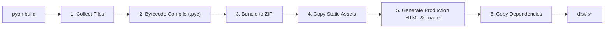

# Rancangan Implementasi: `pyon build` — Build System & Production Bundling

## Ringkasan

Perintah CLI `pyon build` akan mengubah proyek PyOn-Py dari mode pengembangan (per-file HTTP fetching) menjadi sebuah artefak produksi yang siap di-deploy sebagai situs statis. Output-nya adalah sebuah folder `dist/` yang sepenuhnya *self-contained* — cukup di-serve oleh HTTP server statis manapun (Nginx, Caddy, GitHub Pages, Vercel, Netlify, dsb).

---

## Arsitektur Build Pipeline



---

## Output Structure

```
dist/
├── index.html              ← Production HTML (tanpa hot-reload SSE)
├── loader.js               ← Production loader (unpackArchive, tanpa fetchAndWriteFile)
├── app.zip                 ← Seluruh kode Python (.pyc) dalam 1 arsip
├── packages/               ← Dependency wheels dari packages_cache/
│   ├── requests-2.31.0-py3-none-any.whl
│   └── ...
├── pyodide/                ← (opsional) Self-hosted Pyodide runtime
│   ├── pyodide.js
│   ├── pyodide.asm.wasm
│   └── ...
└── static/                 ← Asset statis (CSS hasil build developer, gambar, font)
    └── css/output.css
```

---

## Fase-Fase Build Pipeline

### Fase 1: Collect Files (Reuse `_collect_py_files`)

Mengumpulkan semua file `.py` dari framework (`pyon/`) dan proyek user (`src/`, `app.py`), menggunakan logika yang sudah ada di [`server.py#_collect_py_files()`](file:///home/rnd/Documents/projects/pyon-py/pyon/dev_server/server.py#L124-L160).

Fungsi ini akan di-refactor menjadi utilitas bersama (`pyon/cli/utils/file_collector.py`) agar bisa dipakai oleh dev server **dan** build system tanpa duplikasi.

```python
# pyon/cli/utils/file_collector.py
def collect_project_files(project_root: Path) -> list[Path]:
    """Collect all .py files from framework + project, sorted by import order."""
    # Reuse logic dari _collect_py_files()
    ...
```

### Fase 2: Bytecode Compilation (`.py` → `.pyc`)

Kompilasi semua file Python menjadi bytecode menggunakan `compileall` / `py_compile` standar. Pyodide mendukung loading `.pyc` secara native, sehingga ini **menghilangkan fase parsing AST Python** di browser.

```python
import py_compile
import compileall
from pathlib import Path

def compile_to_bytecode(source_dir: Path, output_dir: Path) -> None:
    """Compile all .py files to .pyc in a mirrored directory structure."""
    for py_file in source_dir.rglob("*.py"):
        rel = py_file.relative_to(source_dir)
        # Output: __pycache__/module.cpython-3xx.pyc → module.pyc (flat)
        out_pyc = output_dir / rel.with_suffix(".pyc")
        out_pyc.parent.mkdir(parents=True, exist_ok=True)
        py_compile.compile(
            str(py_file),
            cfile=str(out_pyc),
            doraise=True,
        )
```

> [!NOTE]
> Pyodide menjalankan CPython versi spesifik (misal 3.12.x).
> File `.pyc` harus dikompilasi menggunakan versi Python yang **sama persis** dengan yang digunakan oleh Pyodide target.
> Jika versi berbeda, Pyodide akan membuang `.pyc` dan fallback ke parsing `.py` biasa (tidak error, hanya kehilangan keuntungan).
> Oleh karena itu, **file `.py` asli tetap disertakan di dalam ZIP** sebagai fallback. Pyodide akan memprioritaskan `.pyc` jika magic number cocok.

### Fase 3: Bundle to ZIP

Mengemas seluruh file Python (`.py` + `.pyc`) ke dalam satu arsip `app.zip`. Pyodide memiliki API built-in `pyodide.unpackArchive()` yang bisa mengekstrak ZIP langsung ke MEMFS dalam satu operasi.

```python
import zipfile

def create_bundle(
    staging_dir: Path,    # Direktori berisi .py + .pyc
    output_path: Path,    # dist/app.zip
) -> None:
    """Create a ZIP archive of the entire project for Pyodide's unpackArchive."""
    with zipfile.ZipFile(output_path, "w", zipfile.ZIP_DEFLATED) as zf:
        for file_path in staging_dir.rglob("*"):
            if file_path.is_file():
                arcname = str(file_path.relative_to(staging_dir))
                zf.write(file_path, arcname)
```

### Fase 4: Copy Static Assets (Pass-Through)

Menyalin seluruh aset statis yang dibutuhkan ke `dist/`. Build system **tidak melakukan proses kompilasi/purging CSS** (seperti Tailwind CLI) secara otomatis — proses kompilasi CSS (misal `npx tailwindcss -i input.css -o output.css`) merupakan tanggung jawab pengembang sebelum menjalankan build.

PyOn-Py memperlakukan file statis secara *pass-through* (salin langsung apa adanya):

```python
import shutil

def copy_static_assets(project_root: Path, dist_dir: Path) -> None:
    """Copy static assets (CSS, images, fonts, public files) to dist."""
    # 1. Salin folder src/static/ jika ada -> dist/static/ atau dist/src/static/
    static_dirs = [
        (project_root / "src" / "static", dist_dir / "src" / "static"),
        (project_root / "static", dist_dir / "static"),
        (project_root / "public", dist_dir),
    ]
    for src, dst in static_dirs:
        if src.exists() and src.is_dir():
            shutil.copytree(src, dst, dirs_exist_ok=True)

### Fase 5: Generate Production HTML & Loader

Membuat `index.html` dan `loader.js` versi produksi yang **sangat berbeda** dari versi dev:
- **Tidak ada SSE hot-reload**
- **Tidak ada `fetchAndWriteFile` per-file** — diganti `pyodide.unpackArchive()`
- **Tidak ada dev tools** (`window.__pyon_py`)
- **Environment variables** dibaca dari `.env.production`

#### `loader.js` Produksi (Skema)

```javascript
// loader.js — PRODUCTION BUILD by pyon build
const PYODIDE_URL = "{{pyodide_url}}";
const PACKAGES = {{deps_json}};
const LOCK_PACKAGES = {{lock_json}};
const PYON_ENV = {{env_json}};

async function loadScript(url) { /* sama seperti dev */ }

async function injectEnv(pyodide) { /* sama seperti dev */ }

async function initPyOnPy() {
    try {
        console.log("[PyOnPy] Loading Pyodide...");
        await loadScript(PYODIDE_URL);
        window.__pyodide = await loadPyodide();
        window.__pyodide.runPython('import os; os.environ["PYON_ENV"] = "production"');
        window.__pyodide.runPython('import sys; sys.path.insert(0, "/")');

        // Install dependencies
        console.log("[PyOnPy] Installing dependencies...");
        await window.__pyodide.loadPackage("micropip");
        const micropip = window.__pyodide.pyimport("micropip");

        // Local wheels first
        for (const [name, filename] of Object.entries(LOCK_PACKAGES)) {
            await micropip.install(`/packages/${filename}`);
        }
        await micropip.install(["typing-extensions", ...PACKAGES]);

        // === KEY DIFFERENCE: Single ZIP instead of N fetches ===
        console.log("[PyOnPy] Loading application bundle...");
        const response = await fetch("/app.zip");
        const buffer = await response.arrayBuffer();
        window.__pyodide.unpackArchive(buffer, "zip");

        // Inject env
        await injectEnv(window.__pyodide);

        // Mount app
        console.log("[PyOnPy] Rendering...");
        const appEl = document.getElementById("app");
        if (appEl) appEl.innerHTML = "";

        await window.__pyodide.runPythonAsync(`
from app import start
start()
`);

    } catch (err) {
        console.error("[PyOnPy] Error:", err);
    }
}

initPyOnPy();
```

> [!IMPORTANT]
> Perbedaan utama dengan dev loader:
> 1. **Tidak ada `fetchAndWriteFile` loop** — diganti 1x `fetch("/app.zip")` + `unpackArchive`
> 2. **Tidak ada SSE listener** (`new EventSource("/__reload")`) — dihapus total
> 3. **Tidak ada fungsi `restart()`** — tidak diperlukan di produksi
> 4. **`PYON_ENV` di-set ke `"production"`**

#### `index.html` Produksi

```html
<!DOCTYPE html>
<html lang="en">
<head>
    <meta charset="UTF-8">
    <meta name="viewport" content="width=device-width, initial-scale=1.0">
    <title>{{project_name}}</title>
    <link href="/static/css/output.css" rel="stylesheet">
</head>
<body>
    <div id="app"></div>
    <script src="/loader.js"></script>
</body>
</html>
```

### Fase 6: Copy Dependencies

Menyalin semua file wheel dari `packages_cache/` ke `dist/packages/` dan (opsional) menyalin Pyodide runtime dari `pyodide_cache/` ke `dist/pyodide/`.

```python
def copy_dependencies(project_root: Path, dist_dir: Path, include_pyodide: bool) -> None:
    """Copy wheel files and optionally Pyodide runtime to dist."""
    # Wheels
    cache_dir = project_root / "packages_cache"
    if cache_dir.exists():
        shutil.copytree(cache_dir, dist_dir / "packages", dirs_exist_ok=True)
    
    # Pyodide (opsional — jika user ingin self-host)
    if include_pyodide:
        pyodide_dir = project_root / "pyodide_cache"
        if pyodide_dir.exists():
            shutil.copytree(pyodide_dir, dist_dir / "pyodide", dirs_exist_ok=True)
```

---

## CLI Interface

```python
# pyon/cli/build.py
import click

@click.command()
@click.option("--outdir", default="dist", help="Output directory (default: dist)")
@click.option("--no-bytecode", is_flag=True, help="Skip .pyc compilation")
@click.option("--include-pyodide", is_flag=True, help="Copy Pyodide runtime to dist for self-hosting")
def build(outdir, no_bytecode, include_pyodide):
    """Build project for production deployment."""
    ...
```

**Contoh penggunaan:**
```bash
# Build standar
pyon build

# Build tanpa bytecode (fallback .py saja)
pyon build --no-bytecode

# Build dengan self-hosted Pyodide
pyon build --include-pyodide

# Build ke folder custom
pyon build --outdir build
```

---

## Konfigurasi `pyon.toml`

```toml
[project]
name = "my-pyon-app"
version = "0.1.0"

[build]
outdir = "dist"              # Output directory
bytecode = true              # Compile .py → .pyc
include_pyodide = false      # Self-host Pyodide?

[build.env]
file = ".env.production"     # Environment file untuk production
```

---

## Alur Eksekusi `pyon build`

```
$ pyon build

PyOn-Py Build System v0.1.1
━━━━━━━━━━━━━━━━━━━━━━━━━━

[1/6] Collecting files...
      Found 57 Python files (framework: 42, project: 15)

[2/6] Compiling bytecode...
      Compiled 57 .pyc files (Python 3.12)

[3/6] Creating bundle...
      app.zip: 114 files, 245 KB (compressed from 892 KB)

[4/6] Copying static assets...
      ✓ Copied static files to dist/

[5/6] Generating production assets...
      ✓ index.html
      ✓ loader.js (production mode, no hot-reload)

[6/6] Copying dependencies...
      ✓ 2 wheel packages → dist/packages/

━━━━━━━━━━━━━━━━━━━━━━━━━━
   Build complete! Output: dist/
   Total size: 312 KB (excluding Pyodide runtime)

   Deploy with any static file server:
     npx serve dist
     python -m http.server -d dist
```
