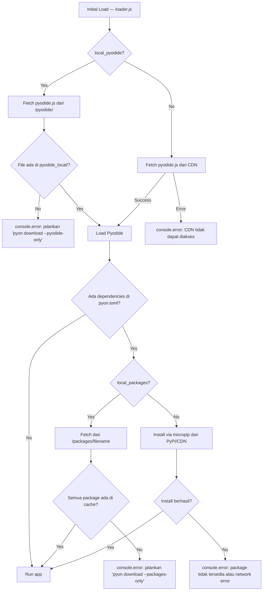

# Spesifikasi Manajemen Dependency & Asset Loading PyOn-Py

Dokumen ini mendeskripsikan arsitektur pengelolaan dependensi dan aset loading untuk framework PyOn-Py, mencakup perintah CLI, mekanisme browser-side loading, format konfigurasi, dan lock file.

Dokumen ini menggantikan dan menyatukan:
- `DEPENDENCY_MANAGEMENT.md` (versi sebelumnya)
- `LOCAL_PYODIDE.md` (versi sebelumnya)

Terkait perintah CLI lainnya, lihat [CLI_PACKAGE.md](file:///home/rnd/Documents/projects/pyon-py/docs/plan/specs/CLI_PACKAGE.md).
Terkait dev server, lihat [DEV_SERVER.md](file:///home/rnd/Documents/projects/pyon-py/docs/plan/specs/DEV_SERVER.md).

---

## 1. Konsep Inti: Dua Lapisan Dependency

PyOn-Py beroperasi di dua runtime yang berbeda. Setiap dependensi harus diklasifikasikan berdasarkan lapisan mana yang membutuhkannya.

### Layer 1 — Host Machine (Development)

- **Diinstal via:** `pip` ke `venv` lokal.
- **Tujuan:** IDE autocomplete, type checking, source code navigation, dev tools (`pytest`, `ruff`), dan eksekusi skrip lokal.
- **Mencakup semua dependensi** — baik yang dibutuhkan browser maupun yang murni development-only.

### Layer 2 — Browser Runtime (Pyodide)

- **Diinstal via:** `micropip` saat aplikasi dimuat di browser.
- **Tujuan:** Dependensi yang digunakan langsung oleh kode Python yang berjalan di dalam Pyodide/WebAssembly.
- **Subset dari Layer 1** — Paket seperti `pytest`, `ruff`, atau linter lainnya **tidak pernah** diinstal di browser.

### Keterbatasan Layer 2

> [!IMPORTANT]
> **Hanya pure Python wheels** yang dapat diinstal oleh `micropip` kecuali paket tersebut sudah memiliki build `wasm32` di [Pyodide Package Index](https://pyodide.org/en/stable/usage/packages-in-pyodide.html).
> Paket dengan C extension native (contoh: `uvloop`, `psycopg2`) **tidak kompatibel** dengan Pyodide.
> CLI `pyon add` wajib memvalidasi kompatibilitas ini dan memberikan peringatan eksplisit.

---

## 2. Tiga Tahap Implementasi

Implementasi dirancang dalam tiga tahap yang masing-masing **independen** dan memberikan nilai tersendiri.

| Tahap | Target | Nilai Utama |
|---|---|---|
| 1 | pip wrapper + WASM check + pencatatan deps | Workflow `pyon add` konsisten, WASM check sejak awal |
| 2 | Local package cache + lock file | Dev tanpa internet, reproducible via `pyon.lock` |
| 3 | Local Pyodide | Eliminasi CDN sepenuhnya, load time paling cepat |

---

## 3. `pyon.toml` — Single Source of Truth

Seluruh konfigurasi dependensi terpusat di file `pyon.toml` di root direktori proyek. File ini dibaca oleh CLI (`pyon add`, `pyon download`) dan oleh dev server (untuk menghasilkan `loader.js`).

```toml
[project]
name    = "my-app"
version = "0.1.0"

[dependencies]
packages = ["httpx>=0.27", "anyio>=4.0"]

[dev-dependencies]
packages = ["pytest", "ruff"]

[dev]
pyodide_version = "0.314.0"
local_pyodide   = false   # Tahap 3: load Pyodide dari localhost
local_packages  = false   # Tahap 2: load packages dari localhost
```

### Aturan Pembacaan

| Blok | `pip install` (lokal) | `micropip.install` (browser) | Download wheel ke cache |
|---|:---:|:---:|:---:|
| `[dependencies]` | ✅ | ✅ | ✅ (Tahap 2) |
| `[dev-dependencies]` | ✅ | ❌ | ❌ |

---

## 4. Tahap 1 — pip Wrapper + WASM Compatibility Check

### 4.1 `pyon add` — Tambah Dependency

```bash
pyon add httpx anyio        # runtime dependency (browser + lokal)
pyon add pytest --dev       # dev-only (lokal saja)
```

**Alur internal `pyon add <package>`:**

```
1. pip install <package> ke environment lokal
2. Cek kompatibilitas WASM:
   a. Query PyPI JSON API → cek apakah ada pure Python wheel
   b. Jika tidak ada → cek Pyodide Package Index
   c. Jika tidak compatible → warning + konfirmasi user
3. Resolve versi yang terinstall (dari pip show)
4. Update pyon.toml [dependencies].packages
```

**Alur internal `pyon add <package> --dev`:**

```
1. pip install <package> ke environment lokal
2. TIDAK melakukan cek WASM (tidak akan di-load di browser)
3. Update pyon.toml [dev-dependencies].packages
```

### 4.2 `pyon remove` — Hapus Dependency

```bash
pyon remove httpx
```

**Alur internal:**

```
1. pip uninstall <package>
2. Hapus entri dari pyon.toml [dependencies] atau [dev-dependencies]
```

> [!NOTE]
> Pengelolaan orphan transitive dependencies (misal: menghapus `httpx` tetapi `idna` masih dibutuhkan paket lain) tidak dilakukan secara otomatis. Developer dapat menjalankan `pyon download` untuk menyinkronkan cache.

### 4.3 Validasi Kompatibilitas WASM

Saat `pyon add` dijalankan (tanpa `--dev`):

1. **Cek pure Python wheel:** Query `https://pypi.org/pypi/<package>/json`, periksa apakah ada distribusi dengan `filename` yang cocok pola `*-py3-none-any.whl` atau `*-py2.py3-none-any.whl`.

2. **Jika tidak ada pure wheel:** Cek Pyodide Package Index (`https://cdn.jsdelivr.net/pyodide/v{version}/full/repodata.json`) apakah paket tersedia sebagai built-in Pyodide.

3. **Output warning:**
   ```
   ⚠ WARNING: Package 'numpy' memiliki C extension dan tidak tersedia
   sebagai pure Python wheel.
   
   Pyodide built-in: ✅ numpy tersedia di Pyodide Package Index
   → Package akan diinstal dari CDN Pyodide saat runtime.
   
   Lanjutkan? [Y/n]
   ```

   Atau jika tidak tersedia di mana pun:
   ```
   ⚠ WARNING: Package 'uvloop' memiliki C extension dan TIDAK tersedia
   di Pyodide Package Index.
   
   Package ini TIDAK AKAN berfungsi di browser.
   Gunakan --dev untuk menambahkan sebagai dev-only dependency.
   
   Tetap tambahkan ke [dependencies]? [y/N]
   ```

### 4.4 Integrasi loader.js (Tahap 1)

Dev server membaca `pyon.toml [dependencies]` dan generate blok micropip di `loader.js`:

```javascript
// Auto-generated dari pyon.toml [dependencies]
const PACKAGES = ["httpx>=0.27", "anyio>=4.0"];

async function installDependencies(micropip) {
    if (PACKAGES.length > 0) {
        setStatus("Installing dependencies...");
        await micropip.install(PACKAGES);
    }
}
```

Pada tahap ini, semua package diinstal langsung dari CDN/PyPI via micropip.

### 4.5 Modul & File Baru

| File | Deskripsi |
|---|---|
| `pyon/cli/add.py` | Implementasi command `pyon add` |
| `pyon/cli/remove.py` | Implementasi command `pyon remove` |
| `pyon/cli/utils/toml.py` | Helper untuk baca/tulis `pyon.toml` |
| `pyon/cli/utils/wasm_check.py` | Validasi kompatibilitas WASM via PyPI + Pyodide Index |

### 4.6 Dependensi Framework Baru

| Package | Tujuan |
|---|---|
| `httpx` (atau `urllib`) | Query PyPI JSON API untuk WASM check (bisa pakai stdlib `urllib.request`) |
| `tomli-w` | Menulis file TOML (stdlib `tomllib` hanya bisa baca) |

> [!TIP]
> Untuk menghindari menambah dependency framework, pertimbangkan menggunakan `tomllib` (baca) + serialisasi manual string (tulis) alih-alih `tomli-w`. Atau gunakan `tomlkit` yang mempreservasi format dan komentar.

---

## 5. Tahap 2 — Local Package Cache + Lock File

### 5.1 `pyon download --packages-only`

```bash
pyon download --packages-only
```

**Alur internal:**

```
1. Baca pyon.toml [dependencies].packages
2. pip download --only-binary=:all: --platform any --python-version 3.11 \
     -d packages_cache/ <packages...>
3. Scan packages_cache/*.whl → generate/update pyon.lock
4. Set pyon.toml [dev].local_packages = true
```

### 5.2 `pyon.lock` — Lock File

File lock mencatat versi exact dan filename setiap wheel yang terdownload, termasuk transitive dependencies. File ini **di-commit ke repo** untuk reproducible environment.

**Format:**

```toml
# AUTO-GENERATED oleh pyon download — jangan edit manual
# Di-commit ke repo untuk reproducible environment

[metadata]
generated_at = "2026-09-09T11:00:00+07:00"
python_version = "3.11"
platform = "any"

[packages]
httpx   = { version = "0.27.0", filename = "httpx-0.27.0-py3-none-any.whl" }
anyio   = { version = "4.3.0",  filename = "anyio-4.3.0-py3-none-any.whl" }
certifi = { version = "2024.2.2", filename = "certifi-2024.2.2-py3-none-any.whl" }
idna    = { version = "3.7", filename = "idna-3.7-py3-none-any.whl" }
sniffio = { version = "1.3.1", filename = "sniffio-1.3.1-py3-none-any.whl" }
```

**Mekanisme generasi:** Scan semua file `*.whl` di `packages_cache/` dan ekstrak nama + versi dari konvensi penamaan wheel standar (`{name}-{version}-{python}-{abi}-{platform}.whl`).

> [!IMPORTANT]
> `pyon.lock` menggantikan `manifest.json` dari spec sebelumnya. Format TOML dipilih untuk konsistensi dengan `pyon.toml` dan keterbacaan yang lebih baik.

### 5.3 Route Dev Server: `/packages/<filename>`

Dev server menambahkan route baru untuk menyajikan wheel dari cache lokal:

```python
# di server.py
async def handle_packages(request: web.Request) -> web.Response | web.FileResponse:
    filename = request.match_info["filename"]
    target = (PROJECT_ROOT / "packages_cache" / filename).resolve()
    
    # Security: prevent path traversal
    try:
        target.relative_to(PROJECT_ROOT / "packages_cache")
    except ValueError:
        return web.Response(status=403, text="Forbidden")
    
    if not target.exists():
        return web.Response(status=404, text=f"Package not found: {filename}")
    
    return web.FileResponse(target)

# Route registration:
app.router.add_get("/packages/{filename}", handle_packages)
```

### 5.4 Integrasi loader.js (Tahap 2)

```javascript
const USE_LOCAL_PACKAGES = true;  // dari pyon.toml [dev].local_packages

// Dari pyon.lock (di-embed oleh dev server)
const LOCK_PACKAGES = {
    "httpx": "httpx-0.27.0-py3-none-any.whl",
    "anyio": "anyio-4.3.0-py3-none-any.whl",
    "certifi": "certifi-2024.2.2-py3-none-any.whl",
    // ... transitive deps
};

async function installDependencies(micropip) {
    if (USE_LOCAL_PACKAGES) {
        // Install SEMUA wheel dari cache lokal (termasuk transitif)
        for (const [name, filename] of Object.entries(LOCK_PACKAGES)) {
            try {
                await micropip.install(`/packages/${filename}`);
            } catch (e) {
                console.error(`[PyOnPy] Package '${name}' tidak ditemukan di cache.`);
                console.error(`[PyOnPy] Jalankan: pyon download --packages-only`);
                throw e;
            }
        }
    } else {
        // Fallback: install dari PyPI/CDN
        for (const pkg of PACKAGES) {
            await micropip.install(pkg);
        }
    }
}
```

### 5.5 Modul & File Baru

| File | Deskripsi |
|---|---|
| `pyon/cli/download.py` | Implementasi command `pyon download` |
| `pyon/cli/utils/lock.py` | Helper untuk generate/parse `pyon.lock` |

---

## 6. Tahap 3 — Local Pyodide

### 6.1 `pyon download --pyodide-only`

```bash
pyon download --pyodide-only
```

**Alur internal:**

```
1. Baca pyon.toml [dev].pyodide_version
2. Cek apakah pyodide_local/pyodide.js sudah ada dan versi cocok
3. Jika belum:
   a. Download tarball dari GitHub Releases:
      https://github.com/pyodide/pyodide/releases/download/{version}/pyodide-{version}.tar.bz2
   b. Ekstrak ke pyodide_local/
4. Set pyon.toml [dev].local_pyodide = true
```

**Struktur hasil download:**

```
pyodide_local/
├── pyodide.js
├── pyodide.asm.js
├── pyodide.asm.wasm       (~10MB)
├── python_stdlib.zip
├── repodata.json
└── packages/              ← Built-in packages (numpy, dll)
    └── ...
```

### 6.2 `pyon download` (Tanpa Flag)

Menjalankan **kedua** operasi secara berurutan:

```bash
pyon download
# Equivalent to:
#   pyon download --pyodide-only
#   pyon download --packages-only
```

### 6.3 Route Dev Server: `/pyodide/*`

```python
# di server.py
PYODIDE_LOCAL_DIR = PROJECT_ROOT / "pyodide_local"

async def handle_pyodide(request: web.Request) -> web.Response | web.FileResponse:
    rel_path = request.match_info["path"]
    target = (PYODIDE_LOCAL_DIR / rel_path).resolve()
    
    # Security: prevent path traversal
    try:
        target.relative_to(PYODIDE_LOCAL_DIR)
    except ValueError:
        return web.Response(status=403, text="Forbidden")
    
    if not target.exists():
        return web.Response(status=404, text=f"Pyodide file not found: {rel_path}")
    
    # WASM files need correct MIME type
    content_type = None
    if target.suffix == ".wasm":
        content_type = "application/wasm"
    
    return web.FileResponse(target, headers={"Content-Type": content_type} if content_type else {})

# Route registration (SEBELUM catch-all static handler):
app.router.add_get("/pyodide/{path:.+}", handle_pyodide)
```

### 6.4 Integrasi loader.js (Tahap 3)

```javascript
const USE_LOCAL_PYODIDE = true;  // dari pyon.toml [dev].local_pyodide

async function initPyOnPy() {
    try {
        setStatus("Loading Pyodide...");
        
        if (USE_LOCAL_PYODIDE) {
            // Load dari localhost — ~0.3s vs ~5s dari CDN
            window.__pyodide = await loadPyodide({
                indexURL: "/pyodide/"
            });
        } else {
            // Load dari CDN
            window.__pyodide = await loadPyodide();
        }
        
        // ... sisa inisialisasi
    } catch (err) {
        if (USE_LOCAL_PYODIDE) {
            console.error("[PyOnPy] Pyodide tidak ditemukan di pyodide_local/");
            console.error("[PyOnPy] Jalankan: pyon download --pyodide-only");
        }
        throw err;
    }
}
```

### 6.5 Perubahan `index.html`

Saat `local_pyodide = true`, tag `<script>` untuk Pyodide di `index.html` harus menunjuk ke localhost:

```html
<!-- local_pyodide = true -->
<script src="/pyodide/pyodide.js"></script>

<!-- local_pyodide = false (default) -->
<script src="https://cdn.jsdelivr.net/pyodide/v{version}/full/pyodide.js"></script>
```

Dev server mengatur ini secara otomatis saat men-generate atau menyajikan `index.html`.

---

## 7. Diagram Alur Load



---

## 8. Struktur Folder Proyek Lengkap

```
my-app/
├── pyon.toml               ← Konfigurasi project + deps (di-commit)
├── pyon.lock               ← Versi exact yang terinstall (di-commit, Tahap 2)
├── pyodide_local/          ← Pyodide runtime (gitignore, Tahap 3)
│   ├── pyodide.js
│   ├── pyodide.asm.wasm
│   └── ...
├── packages_cache/         ← Wheel cache (gitignore, Tahap 2)
│   ├── httpx-0.27.0-py3-none-any.whl
│   └── ...
├── index.html
├── app.py                  ← Entry point Python
└── src/
    ├── App.py
    ├── components/
    ├── pages/
    └── static/
```

---

## 9. `.gitignore`

```gitignore
# Asset caches (di-generate oleh pyon download)
pyodide_local/              # ~20MB
packages_cache/             # Ukuran bervariasi

# Python
__pycache__/
*.pyc
.venv/
venv/
*.egg-info/

# Build
dist/
```

`pyon.lock` **di-commit** — memastikan semua developer dan environment CI mendapat versi package yang identik.

---

## 10. Alur Kerja Developer

### Setup Proyek Baru

```bash
mkdir my-app && cd my-app
python -m venv venv && source venv/bin/activate
pip install pyon-py
pyon init                    # Scaffold pyon.toml, index.html, app.py, src/
pyon add httpx               # Tambah dependency pertama
pyon dev                     # Langsung bisa develop (packages dari CDN)
```

### Clone Repositori yang Sudah Ada

```bash
git clone <repo-url>
cd my-app
python -m venv venv && source venv/bin/activate
pip install pyon-py
pyon download                # Install deps + download wheels + download Pyodide
pyon dev                     # Siap develop (semua lokal, tanpa internet)
```

### Tambah Dependency di Tengah Development

```bash
pyon add requests            # Install + cek WASM + update pyon.toml
pyon download --packages-only  # Download wheel ke cache (opsional, untuk offline)
# Dev server otomatis reload
```

---

## 11. Roadmap Implementasi

| Perintah / Fitur | Tahap | Status |
|---|---|---|
| `pyon init` | — | ✅ Selesai |
| `pyon dev` | — | ✅ Selesai |
| `pyon add` | 1 | ⬜ Belum |
| `pyon remove` | 1 | ⬜ Belum |
| WASM compatibility check | 1 | ⬜ Belum |
| loader.js: micropip dari CDN | 1 | ⬜ Belum |
| `pyon download --packages-only` | 2 | ⬜ Belum |
| `pyon.lock` generation | 2 | ⬜ Belum |
| Route `/packages/*` | 2 | ⬜ Belum |
| loader.js: install dari cache | 2 | ⬜ Belum |
| `pyon download --pyodide-only` | 3 | ⬜ Belum |
| Route `/pyodide/*` | 3 | ⬜ Belum |
| loader.js: load Pyodide lokal | 3 | ⬜ Belum |
| `pyon download` (gabungan) | 3 | ⬜ Belum |
| `pyon build` | Nanti | ⬜ Ditunda |
