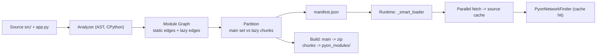

# Dependency Manifest — Rancangan

## 1. Masalah yang Diselesaikan

Network loader saat ini bekerja **lazy per-modul & sinkron**: setiap `import` memicu XHR blocking. Untuk komponen lazy `Home` yang mengimpor `Card` → `Card` mengimpor `utils` → terjadi **waterfall**:

```
XHR Home.py ──► parse ──► XHR Card.py ──► parse ──► XHR utils.py ...
```

Setiap XHR memblokir main thread (UI freeze). Manifest menyelesaikannya dengan memberi tahu runtime **di awal** seluruh file yang dibutuhkan sebuah lazy entry, sehingga bisa di-fetch **paralel & async**, lalu `import` berjalan sinkron tanpa jaringan.

```
fetch Home.py ┐
fetch Card.py ├─(asyncio.gather)──► simpan ke source cache ──► import_module("src.pages.Home") (0 XHR)
fetch utils.py┘
```

> [!IMPORTANT]
> Manifest adalah **optimasi murni**. Jika manifest tidak ada / modul tidak terdaftar, `PyonNetworkFinder` tetap fallback ke XHR sinkron seperti sekarang. Ini menjaga correctness bahkan saat analisis statis meleset (misal dynamic import).

---

## 2. Arsitektur Umum



Satu analyzer (`pyon/cli/utils/dep_graph.py`) dipakai oleh **dev server** (generate on-the-fly) dan **build** (tulis ke disk). Pure Python, tanpa Pyodide → mudah di-test dengan pytest.

---

## 3. Deteksi Dependency (Analisis Statis via `ast`)

### 3.1 Resolusi modul → file

Hanya modul yang **resolve ke file di project** yang masuk graph. Stdlib, `pyon.*`, dan paket pip otomatis tersaring karena tidak punya file di `src/`.

```python
def resolve_module(name: str, root: Path) -> Path | None:
    base = root / Path(*name.split("."))
    if (f := base.with_suffix(".py")).is_file():
        return f
    if (f := base / "__init__.py").is_file():
        return f
    if base.is_dir():
        return NAMESPACE_PKG   # sentinel: implicit namespace package
    return None
```

### 3.2 Ekstraksi import per file

Visitor AST yang mengumpulkan dua jenis edge:

| Jenis edge | Sumber | Diikuti saat closure? |
|---|---|---|
| **static** | `import x`, `from x import y`, `from . import y`, `importlib.import_module("literal")` | Ya |
| **lazy** | `lazy("src.pages.Home", "Home")` (arg pertama string literal) | Tidak — jadi entry chunk baru |

Aturan penting:

1. **Relative import** — `from ..components import Card` di `src/pages/Home.py` di-resolve memakai `level` + nama package file (`src.pages`) → `src.components`.
2. **`from pkg import name`** — `name` bisa atribut *atau* submodul. Cek `resolve_module(f"{pkg}.{name}")`; bila ada file, tambahkan sebagai edge juga.
3. **Parent packages** — import `a.b.c` mengeksekusi `a/__init__.py` dan `a/b/__init__.py`. Semua parent yang punya `__init__.py` ikut menjadi edge.
4. **`if TYPE_CHECKING:`** — skip seluruh body (tidak dieksekusi di runtime).
5. **Import di dalam fungsi** — tetap dianggap static (konservatif; lebih baik over-fetch daripada XHR waterfall). *Kecuali* import di dalam fungsi loader yang dioper ke `lazy()` → lazy edge.
6. **`try: import x / except ImportError`** — ikut bila resolve ke file lokal.
7. **Dynamic tidak bisa dianalisis** (`import_module(var)`, `__import__(f"...")`) → **warning** di CLI, runtime fallback XHR.

### 3.3 Deteksi `lazy()`

Hanya `Call` yang `func`-nya merujuk ke `lazy` **yang diimpor dari `pyon` / `pyon.core.lazy`** (cek alias di tabel import file tersebut agar fungsi `lazy` milik user lain tidak salah terdeteksi).

```python
class ImportVisitor(ast.NodeVisitor):
    def visit_Call(self, node: ast.Call):
        if self._is_pyon_lazy(node.func) and node.args:
            arg = node.args[0]
            if isinstance(arg, ast.Constant) and isinstance(arg.value, str):
                self.lazy_edges.add(arg.value)
            elif isinstance(arg, (ast.Lambda,)) or self._is_local_func(arg):
                # callable loader: scan import di body-nya sebagai lazy edge
                self.lazy_edges |= self._imports_in(arg)
            else:
                self.warnings.append(f"{self.file}:{node.lineno} lazy() loader tidak bisa dianalisis")
        self.generic_visit(node)
```

---

## 4. Algoritma Partisi

```python
graph = build_graph(root)                      # {module: Node(static=set, lazy=set)}

main = closure(graph, ENTRY)                   # ENTRY = "app" ; hanya ikuti static edges
lazy_entries = worklist dari semua lazy edges (termasuk lazy bersarang di dalam chunk)

for L in lazy_entries:
    chunk[L] = toposort(closure(graph, L) - main)
```

Poin desain:

- **Tidak ada chunk-splitting / dedup seperti bundler JS.** Karena artefak kita **per-modul** (`pyon_modules/src/components/Card.py`), modul yang dipakai bersama oleh `Home` dan `Chat` cukup **didaftarkan di kedua entry**. Bytes tidak terduplikasi; browser HTTP cache + source cache runtime mencegah fetch ganda.
- **Lazy yang "dikalahkan"**: jika `L ∈ main` (ada static import ke `src.pages.Home` di jalur eager), keluarkan **warning**: *"src.pages.Home dideklarasikan lazy tetapi diimpor statis oleh app.py — lazy loading tidak efektif."*
- **Siklus import** aman karena closure berbasis set + visited.
- **Toposort (post-order DFS)** — tidak wajib untuk correctness (semua source di-cache sebelum import), tapi berguna untuk debugging & preload hint.

---

## 5. Format Manifest

`/pyon_modules/manifest.json`

```json
{
  "version": 1,
  "entries": {
    "src.pages.Home": ["src.components.Card", "src.utils.format", "src.pages.Home"],
    "src.pages.Chat": ["src.components.Card", "src.pages.Chat"]
  },
  "modules": {
    "src.pages.Home":        { "path": "src/pages/Home.py",        "hash": "9f3a1c" },
    "src.components.Card":   { "path": "src/components/Card.py",   "hash": "1b77e0" },
    "src.utils.format":      { "path": "src/utils/format.py",      "hash": "c02d4e" },
    "src.pages.Chat":        { "path": "src/pages/Chat.py",        "hash": "77aa01" }
  },
  "packages": {
    "src":            { "init": null },
    "src.pages":      { "init": null },
    "src.components": { "init": "src/components/__init__.py" }
  }
}
```

- `entries` → daftar nama modul (bukan path) agar lookup langsung dengan nama `import`.
- `hash` (8 char sha256 konten) → cache-busting via `?v=hash` (build) dan deteksi perubahan (HMR).
- `packages` → finder bisa membuat namespace package **tanpa round-trip 406** ke server.

---

## 6. Integrasi Runtime

### 6.1 `pyon/runtime/manifest.py`

```python
_manifest: dict | None = None
_source_cache: dict[str, str] = {}     # fullname -> source

async def load_manifest() -> None: ...           # fetch sekali saat boot, toleran 404

async def prefetch(entry: str) -> None:
    if not _manifest or entry not in _manifest["entries"]:
        return                                     # fallback: finder XHR
    todo = [m for m in _manifest["entries"][entry]
            if m not in sys.modules and m not in _source_cache]
    sources = await asyncio.gather(*(_fetch_module(m) for m in todo))
    _source_cache.update(zip(todo, sources))
```

### 6.2 `PyonNetworkFinder.find_spec` — urutan lookup baru

1. `fullname in manifest["packages"]` → buat package spec (pakai `_source_cache` untuk `__init__`).
2. `fullname in _source_cache` → `pop()` source, buat spec (tanpa jaringan).
3. Fallback XHR sinkron (kode sekarang).

`pop()` agar memori source string dilepas setelah modul dieksekusi.

### 6.3 `lazy()` default loader

```python
async def _default_loader():
    from pyon.runtime.manifest import prefetch
    await prefetch(module_path)                 # paralel, async, non-blocking
    module = import_module(module_path)         # sinkron, semua cache hit
    return getattr(module, class_name)
```

Router prefetch (`Link._on_mouse_enter` → `_start_loading()`) otomatis ikut memakai jalur ini — tidak ada perubahan di router.

---

## 7. Integrasi Dev Server & Build

| | Dev server | Build |
|---|---|---|
| Generate | Endpoint `GET /pyon_modules/manifest.json` memanggil analyzer, hasil di-cache di memori | `pyon build` menulis `dist/pyon_modules/manifest.json` |
| Invalidasi | `watch_files()` mengosongkan cache manifest saat ada `.py` berubah | — |
| `loader.js` | Tetap memuat semua non-`src` + `__init__.py` (seperti sekarang) | Main set → zip; chunk → `pyon_modules/` |
| Warnings | Dicetak di terminal saat manifest digenerate | Dicetak; opsi `--strict` menjadikannya error |

> [!TIP]
> Di dev, loader.js bisa memakai partisi yang sama: muat `main` set di awal (bukan "semua kecuali src/") sehingga perilaku dev = production. Ini juga otomatis menyelesaikan kasus `src/App.py` & `src/store.py` yang saat ini ikut di-fetch via XHR.

---

## 8. Struktur File

```
pyon/cli/utils/dep_graph.py      # resolve_module, ImportVisitor, build_graph, partition, build_manifest
pyon/runtime/manifest.py          # load_manifest, prefetch, _source_cache
pyon/runtime/finder.py            # + lookup packages & _source_cache
pyon/core/lazy.py                 # default loader memanggil prefetch()
pyon/dev_server/server.py         # endpoint manifest.json + invalidasi
pyon/cli/build.py                 # tulis manifest + partisi zip/pyon_modules
tests/test_dep_graph.py
tests/test_runtime_manifest.py
```

---

## 9. Rencana Test (`tests/test_dep_graph.py`, fixture project di `tmp_path`)

1. Absolute, relative (`.`, `..`), dan `from pkg import submodule`.
2. Parent `__init__.py` ikut terdaftar; namespace package tanpa `__init__`.
3. `if TYPE_CHECKING:` di-skip.
4. Stdlib / `pyon` / third-party tidak masuk graph.
5. `lazy("src.pages.Home", "Home")` → entry terpisah; `Card` hanya di chunk, tidak di main.
6. Modul shared muncul di dua entry; modul di main tidak muncul di chunk mana pun.
7. Lazy bersarang (chunk A berisi `lazy(B)`) → B entry sendiri.
8. Warning: lazy dikalahkan static import; `import_module(var)`; `lazy` dari modul non-pyon tidak terdeteksi.
9. Siklus import tidak infinite loop.

---

## 10. Keputusan Terbuka

1. **Penyimpanan hasil prefetch** — (a) `_source_cache` di finder *(rekomendasi: satu jalur import, memori dilepas setelah exec)* atau (b) `FS.writeFile` ke VFS + `importlib.invalidate_caches()` (memakai FileFinder bawaan, tapi butuh dua mekanisme).
2. **Dukungan loader callable di `lazy()`** — hanya string literal (sederhana, deterministik) atau juga lambda/fungsi lokal (lebih fleksibel, analisis lebih rumit)?
3. **Cache-busting di build** — query `?v=hash` (struktur folder tetap, cocok dengan finder sekarang) atau nama file ber-hash `Card.1b77e0.py` (CDN-friendly, butuh mapping di manifest)?
4. **Import di dalam fungsi** — tetap dianggap eager (konservatif) seperti rancangan, atau diperlakukan sebagai lazy edge implisit?
