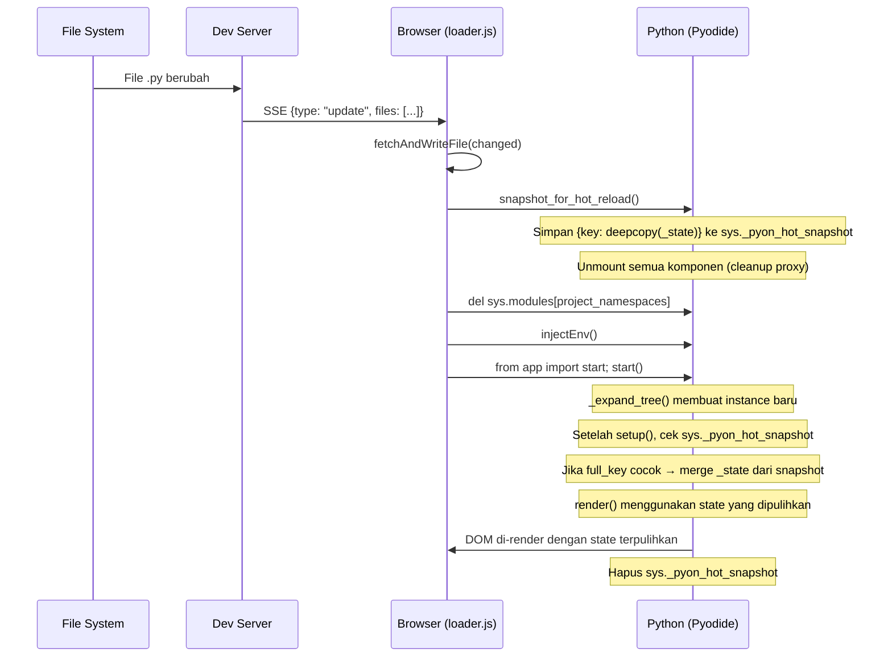

# Stateful Hot Reload — Design Specification

## 1. Masalah Saat Ini

Ketika file `.py` berubah, `loader.js` menjalankan fungsi `restart()` yang melakukan:

```
restart() → fetchAndWriteFile(changed) → del sys.modules[...] → teardown() → start()
```

Fungsi `teardown()` memusnahkan **seluruh** `component_map` beserta `_state`-nya, lalu `start()` membuat instance baru dengan state awal dari `setup()`. Akibatnya:

- Counter yang sudah bernilai 42 kembali ke 0
- Form input yang sudah diisi pengguna terhapus
- Daftar item yang ditambahkan secara dinamis hilang
- Koneksi WebSocket/SSE terputus dan tidak disambung kembali

**Tujuan:** Mempertahankan `_state` komponen yang tidak berubah strukturnya saat *hot reload*, sehingga developer tidak kehilangan konteks UI selama pengembangan.

---

## 2. Analisis Strategi

### Strategi A: `importlib.reload()` + Class Swap (`instance.__class__ = NewClass`)

**Mekanisme:**
```python
importlib.reload(module)
for key, instance in component_map.items():
    NewClass = getattr(module, type(instance).__name__, None)
    if NewClass:
        instance.__class__ = NewClass  # Hot-swap
```

**Keunggulan:**
- Tidak perlu teardown/rebuild — instance tetap hidup
- DOM tidak berkedip sama sekali

**Kelemahan:**
- Rapuh terhadap *circular imports* (Python reload semantics)
- Jika `setup()` atau `__init__` berubah (menambah atribut baru), instance lama tidak memilikinya → `AttributeError`
- Tidak menangani perubahan hierarki komponen (penambahan/penghapusan komponen di tree)
- `importlib.reload()` tidak me-reload sub-module secara transitif
- Memerlukan pemetaan module → class yang kompleks

### Strategi B: Snapshot-Restore (⬅ Dipilih)

**Mekanisme:**
```
snapshot_state() → teardown() → del sys.modules → start() → restore selama _expand_tree
```

**Keunggulan:**
- Robust — bekerja dengan arsitektur `_expand_tree` yang sudah ada
- Menangani perubahan hierarki komponen secara natural (key baru = state baru, key lama = state dipulihkan)
- Decoupled dari mekanisme import Python
- Implementasi sederhana dan mudah di-debug

**Kelemahan:**
- DOM di-rebuild penuh (ada *brief flash*) — bisa dioptimasi di versi berikutnya
- `copy.deepcopy()` bisa gagal untuk objek non-serializable di `_state`

> [!IMPORTANT]
> **Keputusan: Strategi B (Snapshot-Restore)** dipilih karena kesederhanaannya, kompatibilitas penuh dengan arsitektur *keyed component map* yang sudah ada, dan ketahanannya terhadap perubahan struktur kode.

---

## 3. Arsitektur



### Mengapa `sys` Object?

Snapshot disimpan di `sys._pyon_hot_snapshot` karena:
- Modul `sys` **tidak pernah** diinvalidasi oleh proses hot reload (hanya modul `app`, `pyon`, `src` yang di-delete dari `sys.modules`)
- Dapat menyimpan objek Python native (dict, list, dll.) tanpa serialisasi JSON
- Secara otomatis tersedia setelah modul di-reimport

---

## 4. Desain Detail

### 4.1 Fungsi Snapshot (`pyon/core/app.py`)

```python
import sys
import copy

def snapshot_for_hot_reload() -> None:
    """Capture _state dari seluruh component_map ke sys._pyon_hot_snapshot.
    
    Dipanggil dari loader.js SEBELUM module invalidation.
    """
    global _active_app
    if _active_app is None:
        return
    
    snapshot: dict[str, dict] = {}
    for key, inst in _active_app.component_map.items():
        try:
            snapshot[key] = copy.deepcopy(inst._state)
        except Exception:
            pass  # Skip non-copyable state (JS proxies, etc.)
    
    sys._pyon_hot_snapshot = snapshot
    
    # Unmount semua komponen (cleanup JS proxies, abort HTTP, etc.)
    for comp in _active_app.component_map.values():
        try:
            comp._invoke_on_unmount()
        except Exception:
            pass
    
    _active_app.component_map.clear()
    _active_app.dirty_components.clear()
    _active_app = None
```

### 4.2 Restorasi di `_expand_tree` (`pyon/core/app.py`)

Pada blok pembuatan instance baru (setelah `instance.setup()`), tambahkan logika restorasi:

```python
# --- Existing code ---
instance = node.tag(props)
# ... context setup ...
instance.setup()

# --- NEW: Hot reload state restoration ---
_hot_snapshot = getattr(sys, '_pyon_hot_snapshot', None)
if _hot_snapshot and full_key in _hot_snapshot:
    saved_state = _hot_snapshot[full_key]
    # Merge: pertahankan key baru dari setup(), pulihkan value lama
    for k in instance._state:
        if k in saved_state:
            instance._state[k] = saved_state[k]

# --- Continue existing code ---
instance._schedule_update = lambda k=full_key: app._update_from_key(k)
# ...
```

**Strategi Merge:**
```
setup() menghasilkan:    {"count": 0, "name": "", "new_field": []}
snapshot memiliki:       {"count": 42, "name": "John", "deleted_field": "x"}

Hasil merge:             {"count": 42, "name": "John", "new_field": []}
```

- Key yang ada di **kedua sisi** → nilai dari snapshot (dipulihkan)
- Key yang **hanya ada di setup()** → nilai default dari setup() (field baru)
- Key yang **hanya ada di snapshot** → diabaikan (field dihapus oleh developer)

### 4.3 Pembersihan Snapshot (`pyon/core/app.py`)

Setelah `App.mount()` selesai:

```python
def mount(self, selector: str = "#app") -> None:
    # ... existing mount logic ...
    
    # Cleanup hot reload snapshot setelah restoration selesai
    if hasattr(sys, '_pyon_hot_snapshot'):
        restored = len(sys._pyon_hot_snapshot)
        del sys._pyon_hot_snapshot
        # Optional: log untuk DX
        if restored > 0:
            print(f"[PyOnPy] Hot reload: restored state for {restored} components")
```

### 4.4 Perubahan `loader.js` (`pyon/dev_server/server.py`)

```javascript
async function restart(changedFiles) {
    console.log("[PyOnPy] Hot Reloading:", changedFiles);
    
    // 1. Re-fetch only the changed files
    for (const filePath of changedFiles) {
        await fetchAndWriteFile(filePath);
    }

    // 2. NEW: Snapshot state sebelum teardown
    window.__pyodide.runPython(`
from pyon.core.app import snapshot_for_hot_reload
snapshot_for_hot_reload()
`);

    // 3. Invalidate project modules (sama seperti sebelumnya)
    window.__pyodide.runPython(`
import sys
project_namespaces = ("app", "pyon", "src")
to_delete = [k for k in sys.modules if k.startswith(project_namespaces)]
for k in to_delete:
    del sys.modules[k]
`);

    // 4. Re-inject env
    await injectEnv(window.__pyodide);

    // 5. Re-run app (state akan dipulihkan di _expand_tree)
    await runApp();
}
```

> [!NOTE]
> Fungsi `runApp()` tetap sama — ia memanggil `teardown()` (yang kini menjadi no-op karena `_active_app` sudah di-set `None` oleh `snapshot_for_hot_reload()`), membersihkan DOM, lalu menjalankan `start()`. Selama `_expand_tree()`, state dipulihkan secara transparan.

---

## 5. Edge Cases & Penanganan

| Skenario | Perilaku |
|----------|----------|
| Komponen baru ditambahkan | Tidak ada snapshot → `setup()` memberikan state default |
| Komponen dihapus dari tree | Snapshot entry diabaikan, tidak ada efek samping |
| State key baru ditambahkan di `setup()` | Mendapat nilai default dari `setup()` (tidak ada di snapshot) |
| State key dihapus dari `setup()` | Nilai snapshot diabaikan (tidak ada di `_state` baru) |
| `_state` mengandung objek non-copyable | `deepcopy()` gagal → komponen di-skip, mendapat state default |
| Perubahan pada file `.html` | Full page reload (bukan hot reload) — tidak terpengaruh |
| Komponen key berubah (rename) | Dianggap komponen baru → state default |
| `setup()` mengubah tipe state value | Nilai lama di-restore apa adanya (developer responsibility) |

---

## 6. File yang Perlu Diubah

| File | Perubahan |
|------|-----------|
| `pyon/core/app.py` | Tambah `snapshot_for_hot_reload()`, modifikasi `_expand_tree()` untuk restorasi, cleanup di `mount()` |
| `pyon/dev_server/server.py` | Update template `loader.js` pada fungsi `restart()` |

**Total estimasi perubahan: ~30 baris kode baru.**

---

## 7. Optimasi Masa Depan (V2)

Implementasi V1 di atas masih melakukan **full DOM rebuild** (`innerHTML = ""` + `full_render()`). Ini menyebabkan *brief visual flash*. Optimasi V2 yang bisa dilakukan:

1. **Diff-based hot reload**: Alih-alih memanggil `start()` + `full_render()`, panggil method baru `App.hot_reload()` yang:
   - Menyimpan `old_tree = self.current_tree`
   - Re-expand tree dengan class baru + state lama
   - `diff(old_tree, new_tree)` → minimal patches
   - `apply_patches()` — DOM berubah secara minimal tanpa flash

2. **Partial module invalidation**: Hanya invalidasi modul yang benar-benar berubah (berdasarkan `changedFiles`), bukan seluruh namespace. Ini mempercepat re-import.

3. **Store & Context preservation**: Selain `_state`, snapshot juga bisa mencakup `Store` instances dan `Context` values.
